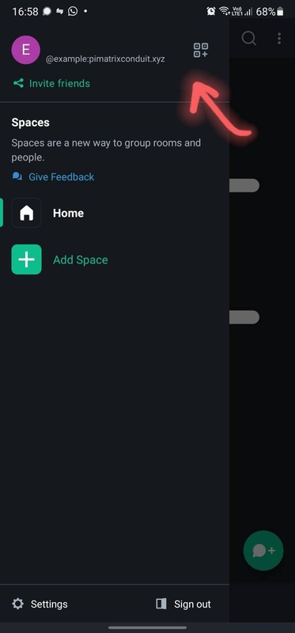
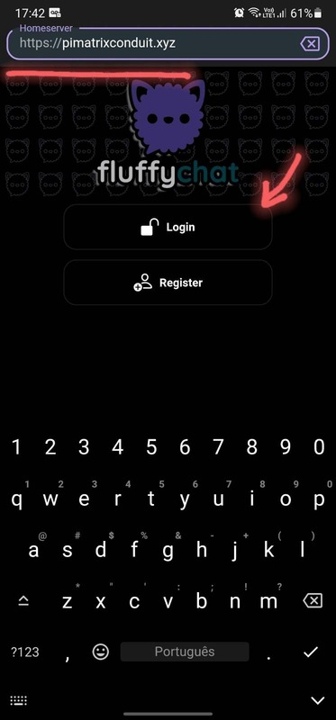

# Usage

## Theory

This project is a matrix server, independent of the applications used to connect to it. This means that you can use the frontend/client app of your choice to follow this tutorial.
Some options are:
- [Element](https://element.io) (web/mobile/desktop) (better support for calls)
- [FluffyChat](https://fluffychat.im) (web/mobile/desktop) (simpler, more traditional design)

Check this [clients list](https://matrix.org/clients) for other options.

It doesn't matter if you and your friends use different apps, you can all communicate by finding each other using identifiers in the form *@username:home.server* (e.g. @seibel:pimatrixconduit.xyz to talk to user *seibel*, myself, who uses the *pimatrixconduit.xyz* homeserver).
You can think of those as analogous to e-mail addresses!

## Practice

We can set up a new user in a homeserver in just a few clicks. 
This guide will use the Element and FluffyChat clients for Android as examples.
You can choose just one of the two.
For the sake of simplicity, the sections below will ilustrate a user sign-**up** on Element, then a user sign-**in** on FluffyChat - so you can test both clients if you so desire.

## Element

After dowloading the app, hit get started.

Now we must choose a homeserver.
We host ours at https://pimatrixconduit.xyz, so go ahead and enter that address.

After that, create a username and (a strong) password. 
No need for phone numbers :)
Note that your username will also be, by default, your display name, but you can change that later!

Element separates direct messages from group chats (rooms).
You can switch between those using the bottom two buttons.
Let's start a new conversation with someone!
Here we'll contact @seibel:pimatrixconduit.xyz, but anyone from any server can be messaged if you know their address.

You can also reach other matrix users by sharing your *@username:home.server* address, an invite link or a QR Code.
You can find this options in the left-side menu.

Finally, you can create or join rooms by selecting the rooms tab and clicking the "new room" button.

Feel free to join our servers' Newcomers room at [#newcomers:pimatrixconduit.xyz](https://matrix.to/#/#newcomers:pimatrixconduit.xyz)!

## FluffyChat

First, edit the homeserver, then click "Login".

Enter the username and password created before.

You'll be shown your existing chats and a button to create new ones.
Click it.

In the New Chats page, you can invite people by sharing your link or QR Code, add people via the same two methods, and also create new groups (rooms).

